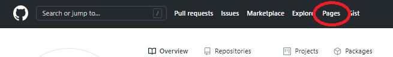

# toPages

  

Add a link to the [GitHub Pages](https://pages.github.com/) user page  
  

## Installation
1. `git clone https://github.com/kumavale/toPages.git` or Download ZIP  
2. Click the Chrome menu icon and select Extensions from the Tools menu. Ensure that the "Developer mode" checkbox in the top right-hand corner is checked.  
3. Click on the "Load unpacked" button.  

